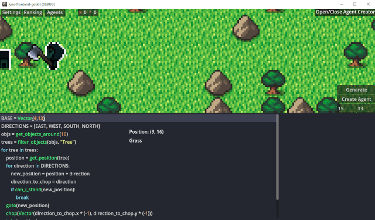
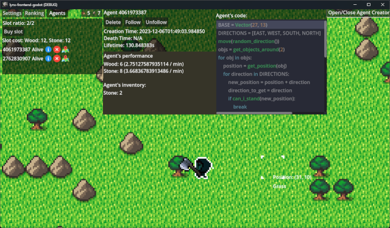

# Abstract
Video games are a widespread form of electronic entertainment. However, the educational programming game genre lacks recognition among gamers, and faces various issues. As a consequence, there exists an unfulfilled educational niche.

The aim of this project was to create a programming game for individuals unfamiliar with programming, where they can learn Python interactively. The game utilises asynchronous communication with a server and consists of a competition that helps to shape the participants' code writing skills and problem-solving abilities.

Existing solutions were reviewed for inspiration during product development. Conclusions drawn from the review were then used to define system requirements specification. The abstraction of the game was planned next, which involved defining the basic elements of the world. Finally, the solution was broken down into an asynchronous scene server, a game client and a shared library. The required components necessitated the use of suitable technologies, which were carefully picked following a thorough review. The solution's development involved focused attention on specific implementation aspects. Post-project completion, different development choices were proffered, and the outcomes were summarised.

The outcome of this effort is a programmatic multiplayer game based on an HTTP server. Its gameplay objective is to gather resources in the game world. The player controls agents whose intelligence is defined by hand-written Python code. The game's primary educational aims are to teach language syntax and problem-solving. The game world's architecture facilitates simple integration of new features. 

**Keywords:** Programming game, Educational game, Browser game, Competition game, Python, Godot, Learning programming, Game development, Multiprocessing, Componentisation

**Field of science and technology in accordance with OECD requirements:** Computer science and information technology

 
